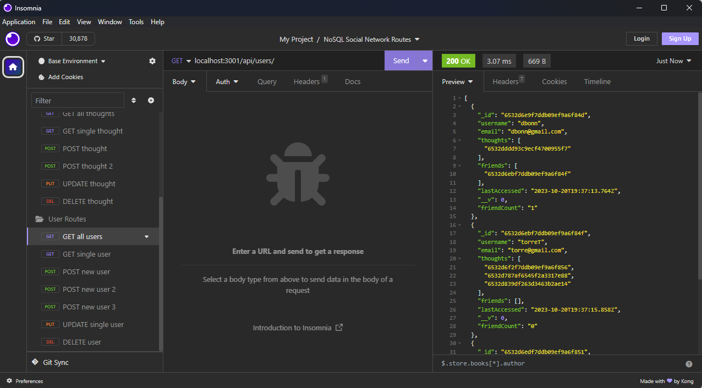

# Nosql API

## Description
  
To familiarize myself with mongodb and nosql databases, I created the backend of a social network database. Building a backend from mongodb is a building block for modern web developer tools and is going to be very important for filling out my understanding of the MERN stack. I learned about using module exports to create controllers for my models and clean up routing by importaing them as well as basic syntax for developing mongodb schema.

- [Installation](#installation)
- [Usage](#usage)
- [Contribute](#contribute)
- [Tests](#tests)
- [Links](#links)
- [Questions](#questions)

## Installation
  
Clone this repository and run npm install to install dependencies locally.

## Usage

  
At the command line, run node server.js and direct yourself to insomnia to test different routes. If you are having trouble figuring out what the routes are check the routes directory for clues.

## Contribute
  
No need to contribute, but any tips on improving my code is appreciated.

## Tests
  
No tests written at this time.

## Links

https://watch.screencastify.com/v/RJjz26tEac0D3rH81guE

## Questions

Username: DanielTBonn
Github: https://github.com/DanielTBonn/
Email: danieltbonn@gmail.com